### 结论
- dom 节点数量对内存影响没想象中大，js 变量才是内存占用的元凶
- 内存占用及性能对比：原生 js ≈ vue for div < vue for 函数式组件 < vue for 普通组件
- 去虚拟 dom 化框架正在崛起，

### dom 节点数量对内存影响没想象中大（十万 div 仅占用 400mb）
- [测试示例](https://blog.luckly-mjw.cn/tool-show/vue-component-performance/pure-js.html)
- 生成 100,000（十万）个 div，内存占用仅 400mb，平均每个 div 占用内存 400 * 1024 kb / 100,000 = 4kb
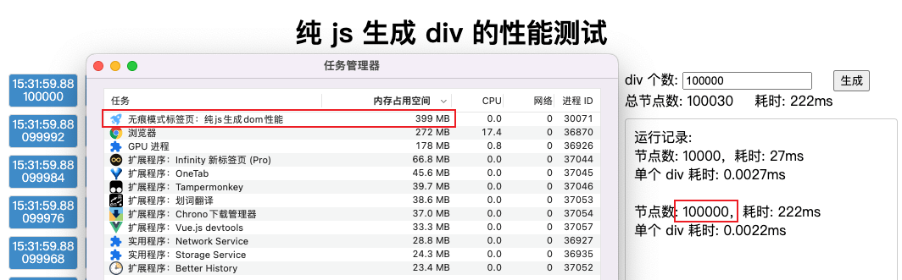
- 注意，这里内存占用是静态状态内存，即需要等 div 都生成后等待一会（1min），内存回收后的内存占用，生成过程中会产生中间变量，占用会比静态时大
- 因此，如果短时间多少清空 div 再重新生成，会导致内存占用飙升
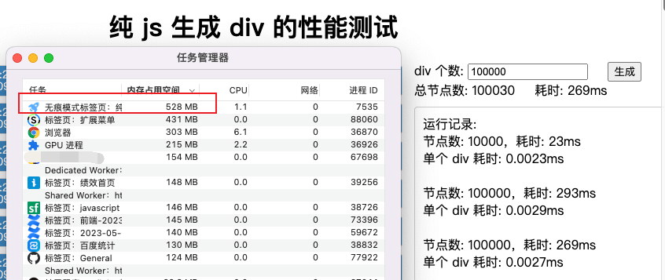

### 组件过多，或许才是 vue 项目内存占用大、运行慢的原因
*分别以「纯 js 渲染 div」、「vue v-for 渲染 div」、「vue v-for 渲染函数式组件」、「vue v-for 渲染普通组件」为例做性能对比测试*

[纯 js 渲染 div](https://blog.luckly-mjw.cn/tool-show/vue-component-performance/pure-js.html)
- 10,000（一万）个 div
  - 渲染耗时：26ms，平均单个div渲染耗时：0.0026ms
  

- 100,000（十万）个 div
  - 渲染耗时：265ms，平均单个div渲染耗时：0.0027ms
  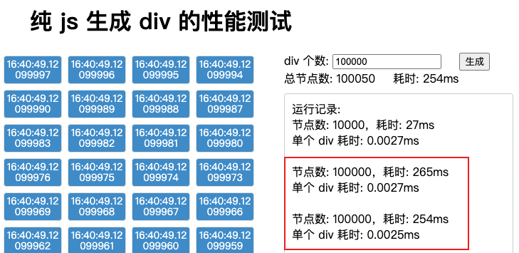

- 100,000（十万）个 div
  - 占用内存：528mb，平均单个占用内存：528 * 1024 / 100,000 = 5.4kb
  

[vue v-for 渲染 div](https://blog.luckly-mjw.cn/tool-show/vue-component-performance/vue-div.html)
- 10,000（一万）个 div
  - 使用 key 缓存节点渲染耗时：61ms，平均单个div渲染耗时：0.0061ms
  - 不使用 key 缓存节点渲染耗时：91ms，平均单个div渲染耗时：0.0091ms
  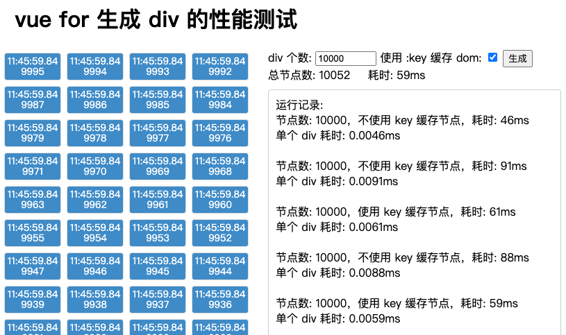
  

- 100,000（十万）个 div
  - 使用 key 缓存节点渲染耗时：499ms，平均单个div渲染耗时：0.005ms
  - 不使用 key 缓存节点渲染耗时：286ms，平均单个div渲染耗时：0.0029ms
  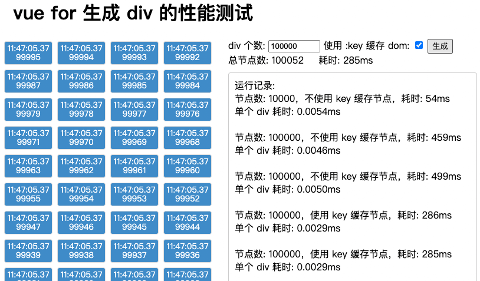

- 100,000（十万）个 div
  - 占用内存：586mb，平均单个占用内存：586 * 1024 / 100,000 = 6kb
  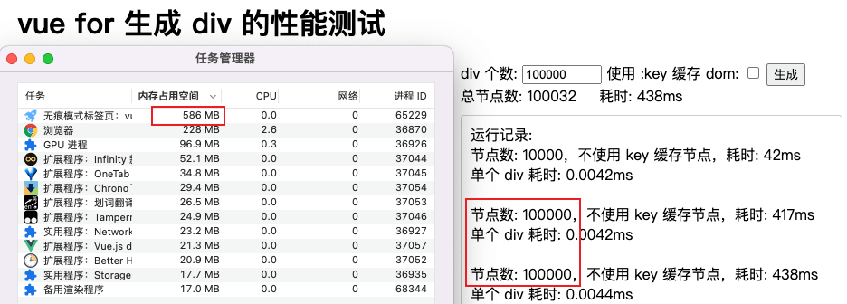

[vue v-for 渲染函数式组件](https://blog.luckly-mjw.cn/tool-show/vue-component-performance/vue-func-component.html)
 - 10,000（一万）个 div
  - 使用 key 缓存节点渲染耗时：85ms，平均单个div渲染耗时：0.0085ms
  - 不使用 key 缓存节点渲染耗时：82ms，平均单个div渲染耗时：0.0082ms
  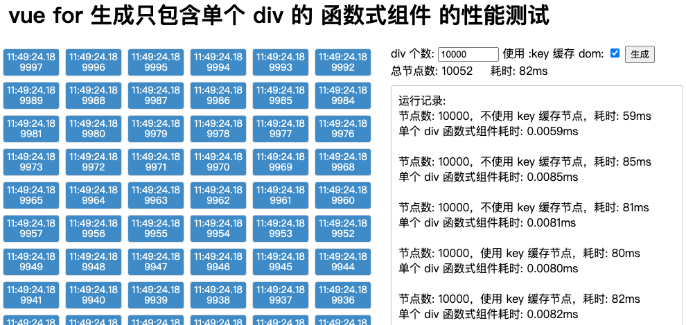
  

- 100,000（十万）个 div
  - 使用 key 缓存节点渲染耗时：392ms，平均单个div渲染耗时：0.0039ms
  - 不使用 key 缓存节点渲染耗时：505ms，平均单个div渲染耗时：0.005ms
  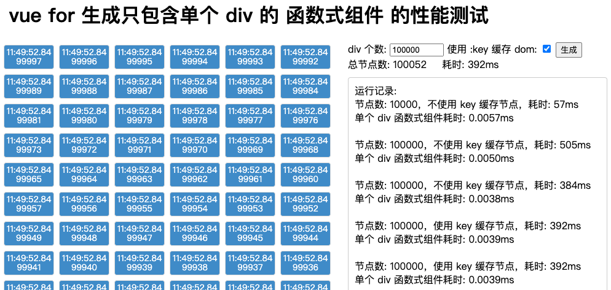

- 100,000（十万）个 div
  - 占用内存：654mb，平均单个占用内存：654 * 1024 / 100,000 = 6.7kb
  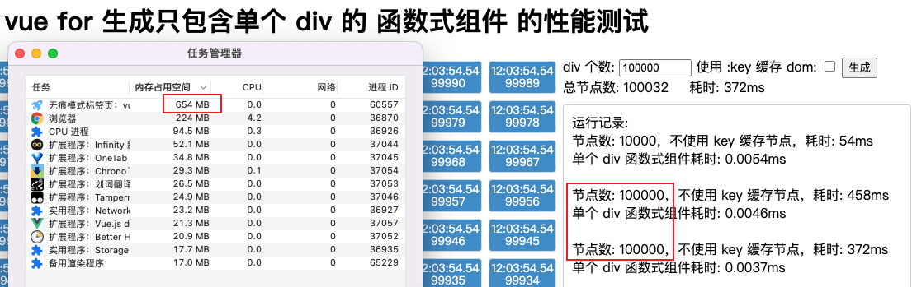

[vue v-for 渲染普通组件](https://blog.luckly-mjw.cn/tool-show/vue-component-performance/vue-component.html)
- 10,000（一万）个 div
  - 使用 key 缓存节点渲染耗时：122ms，平均单个div渲染耗时：0.0122ms
  - 不使用 key 缓存节点渲染耗时：360ms，平均单个div渲染耗时：0.0325ms
  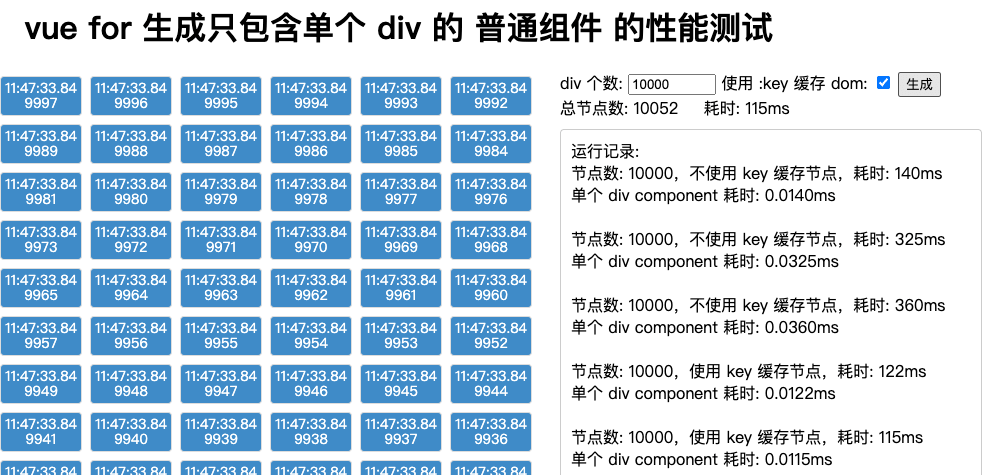
  

- 100,000（十万）个 div
  - 使用 key 缓存节点渲染耗时：918ms，平均单个div渲染耗时：0.0092ms
  - 不使用 key 缓存节点渲染耗时：13881ms(13.8s)，平均单个div渲染耗时：0.1388ms
  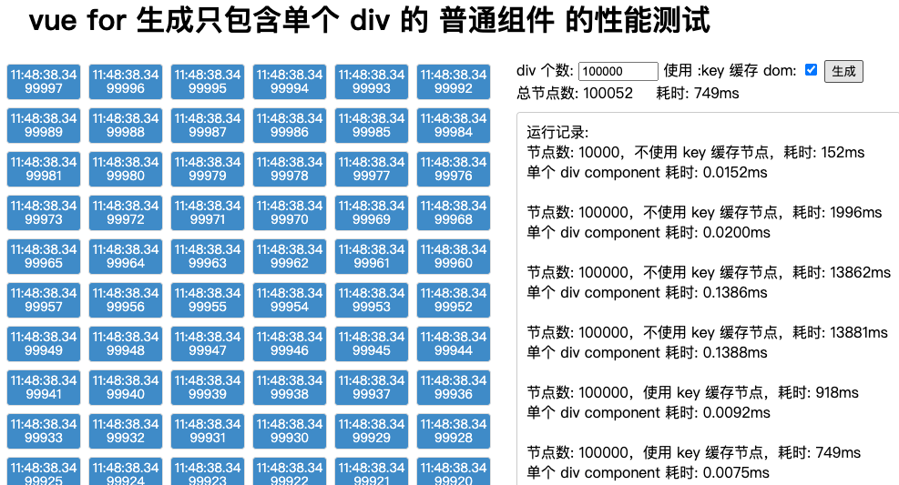

- 100,000（十万）个 div
  - 占用内存：907mb，平均单个占用内存：907 * 1024 / 100,000 = 9.3kb
  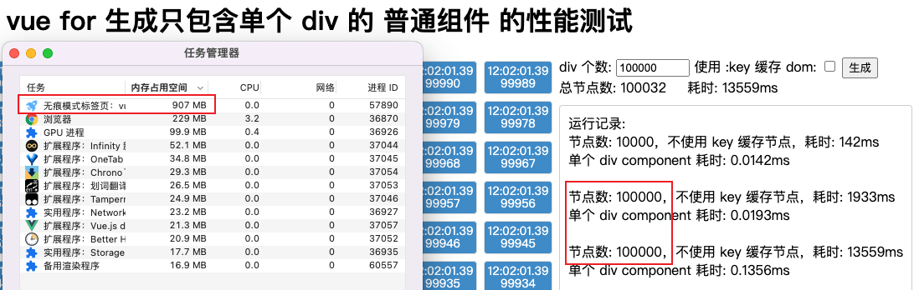

|  | 纯 js 渲染 | vue v-for 渲染 div | vue v-for 渲染函数式组件 | vue v-for 渲染普通组件
| --- | --- | --- | --- | --- |
| 一万div复用key渲染耗时 | - | 61ms/6.1us | 85ms/8.5us  | 122ms/12.2us
| 一万div不复用key渲染耗时 | 26ms/2.6us | 91ms/9.1us | 82ms/8.2us | 360ms/36us
| 十万div复用key渲染耗时 | - | 286ms/2.9us | 392ms/3.9ms | 918ms/9.2us
| 十万div不复用key渲染耗时 | 265ms/2.7us | 499m/5us | 505ms/5us | 13881ms/138.8us
| 十万div内存占用 | 528mb/5.4kb | 586mb/6kb | 652mb/6.7kb | 907mb/9.3kb

vue 组件并非越细越好，颗粒度太细，将导致 vue 组件数量急剧增加，内存占用急剧增加，

### 去虚拟化正在崛起
既然 vue 组件如此消耗性能，那使用虚拟 dom 技术是否仍是最优选择呢，solid 提供了另外一个方向

vnode 的谎言文章
启示

https://www.solidjs.com/guides/rendering